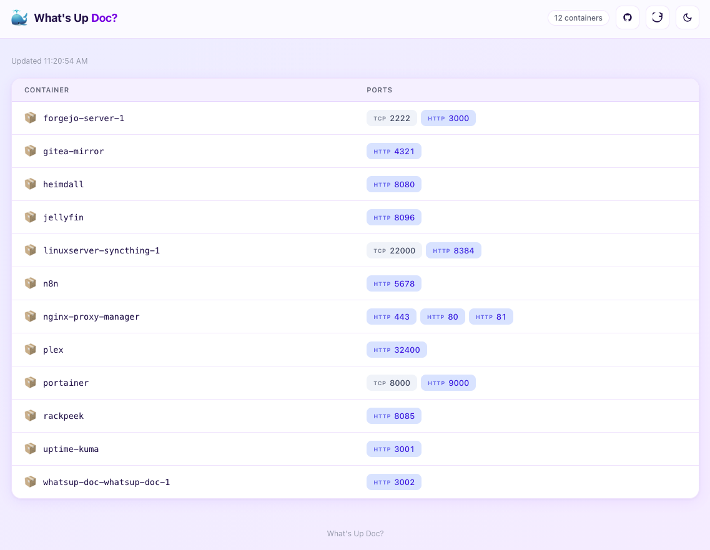
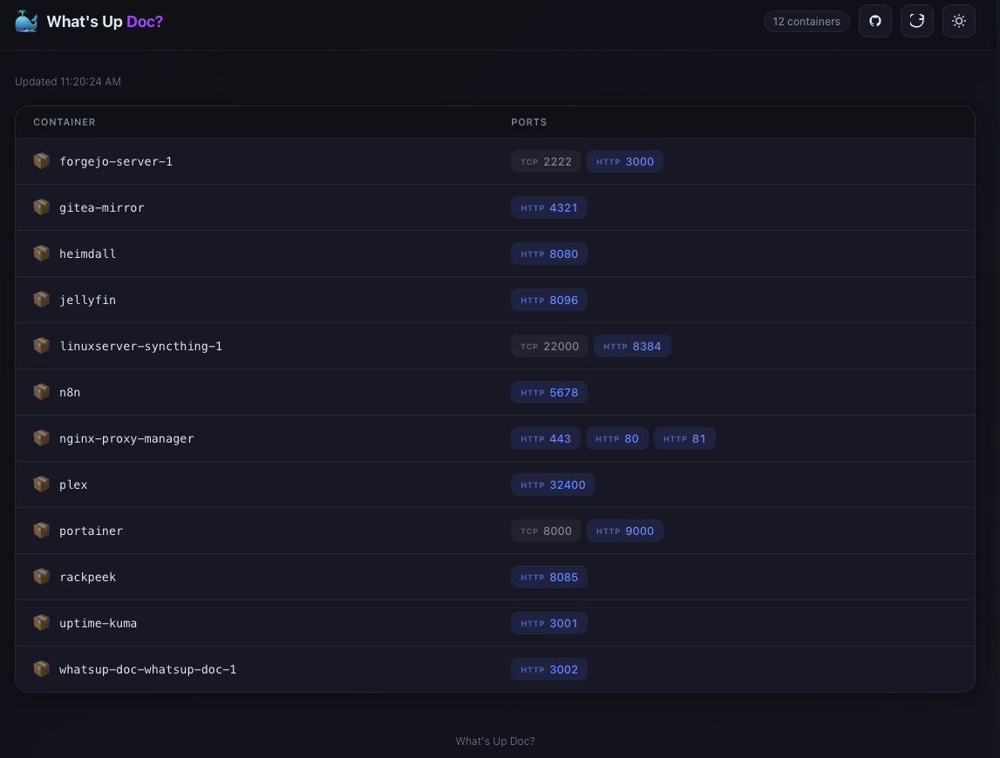

# What's Up Doc?

A lightweight homelab dashboard that shows all published ports from running Docker containers, with clickable links for HTTP/HTTPS services. Automatically refreshes every 30 seconds.

> *"What's up, Doc?" — Bugs Bunny*

Normally you'd use a proper reverse proxy for everything. This is for the services you forgot to add to it, or can never remember which port they're on (*arr apps, I'm looking at you).

## Features

- Shows all containers with published TCP ports
- Detects HTTP/HTTPS automatically — non-web ports (databases, etc.) still appear as TCP
- Light and dark mode with system preference detection
- Auto-refreshes every 30 seconds
- Supports macOS, Linux, and Windows hosts

## Usage

### Docker (recommended)

```bash
docker compose up -d
```

Then visit http://localhost:3000

The `HOST_HOSTNAME` environment variable controls the hostname used in generated links. If unset it defaults to `localhost`, which works for Docker Desktop on macOS/Windows. On a remote Linux host set it to the machine's hostname or IP so links are clickable from other machines:

```bash
HOST_HOSTNAME=myserver.local docker compose up -d
```

### Local development

```bash
bun install
just dev
```

## Justfile

```
just up        # build image and start container
just down      # stop container
just restart   # rebuild and restart
just logs      # tail container logs
just dev       # run Bun dev server locally with hot-reload
just build     # build Docker image with version tag
just release   # build and push image to GHCR
```

## Container image

```
ghcr.io/mattboston/whatsup-doc:latest
```

## Screenshots

### Light mode



### Dark mode



## License

[GPL-3.0](LICENSE)
